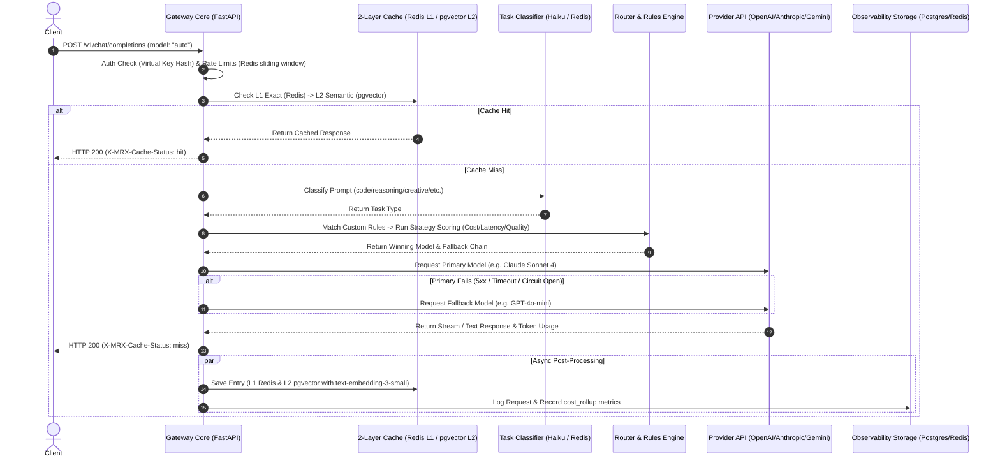

# ModelRouterX

### Self-Hosted Intelligent LLM Gateway & Optimization Platform

ModelRouterX is a self-hosted, production-grade AI gateway designed to sit between your applications and major LLM providers (OpenAI, Anthropic, Google Gemini, Groq, and local Ollama instances). It dynamically routes prompts to the most optimal model based on cost, latency, quality, and task type, offering full observability, multi-tenant semantic caching, per-key rate-limiting, and an interactive real-time dashboard.

```
                  ┌───────────────────────┐
                  │      Client App       │
                  └───────────┬───────────┘
                              │ API request (OpenAI-compatible)
                              ▼
                  ┌───────────────────────┐
                  │   ModelRouterX Gateway│
                  └─────┬─────┬─────┬─────┘
                        │     │     │
            ┌───────────┘     │     └───────────┐
            ▼                 ▼                 ▼
   ┌────────────────┐┌────────────────┐┌────────────────┐
   │  OpenAI / Groq ││   Anthropic    ││ Google Gemini  │
   └────────────────┘└────────────────┘└────────────────┘
```

---

## System Architecture



---

## Key Features

- **Intelligent Routing Engine:** Custom scoring logic weighing Normalized Quality, Cost, and Latency for the specific task type (`creative`, `code`, `reasoning`, `factual`, `chat`, `long_doc`).
- **Dynamic Rules DSL:** Visual rule editor backing JSONB conditions (e.g., routing PHI/HIPAA keywords to dedicated compliant endpoints) evaluated before scoring strategies.
- **Two-Layer Tenant-Isolated Cache:**
  - **L1 (Redis exact match):** Sub-millisecond lookups based on SHA256 prompt hashing.
  - **L2 (pgvector semantic match):** Context-aware lookups via OpenAI `text-embedding-3-small` (with local deterministic hash-projection fallback for offline capability).
  - Multi-tenant isolated via `(tenant_id, model)` composite boundaries.
- **Resilient Fallback Chains & Circuit Breakers:** Monitors error rate in a 60-second sliding window per provider. If a provider's error rate exceeds 20%, the circuit opens, automatically routing traffic to healthy alternatives in the fallback chain.
- **FastAPI Lifecycle integrated Background Scheduler:** Handles non-blocking periodic health check pings (to measure real p50/p95 latency) and daily/hourly cost aggregation rollups.
- **Real-Time Observability UI:** A Next.js 15 dashboard rendering live statistics, cost over time, cache hit rate metrics, provider latency heatmaps, and virtual key usage.

---

## Technical Tradeoffs & Engineering Decisions

### 1. FastAPI (Python) vs. Go/Rust for Gateway Core
- **Decision:** FastAPI (Python).
- **Tradeoff:** Python has higher memory and runtime overhead compared to Go or Rust. However, Python async-first libraries (`FastAPI`, `httpx`, `asyncpg`) are production-grade and easily achieve under **<15ms of gateway overhead** (excluding downstream LLM calls). Selecting Python allowed us to leverage tokenization libraries (`tiktoken`), embedded embeddings, and rapid development without premature optimization.

### 2. pgvector vs. Dedicated Vector Database (Qdrant / Milvus)
- **Decision:** pgvector (PostgreSQL extension).
- **Tradeoff:** Dedicated vector databases handle billions of high-dimensional vectors with sub-millisecond searches. However, pgvector allows keeping all relational transaction data (Request Logs, Virtual Keys, Cost Rollups) and vectors in a single database, eliminating complex multi-service synchronizations. At `<1M` cache entries, an IVFFlat index on pgvector delivers excellent latency.

### 3. Redis L1 Cache vs. Postgres-only Caching
- **Decision:** Redis + Postgres.
- **Tradeoff:** Using Redis adds infrastructure footprint. However, querying PostgreSQL for exact matches takes 1–3ms, whereas Redis handles hot exact match hits in **<0.2ms**, shielding primary databases from high-concurrency repeating queries.

### 4. Async Logging via Background Tasks vs. Message Queue (RabbitMQ/Kafka)
- **Decision:** FastAPI `BackgroundTasks`.
- **Tradeoff:** If the gateway process crashes before writing logs to Postgres, those specific metrics are lost. However, introducing Kafka/RabbitMQ adds massive complexity for a self-hosted single-container stack. FastAPI's async background runner writes logs *after* the client connection is closed, achieving zero-latency impact for the end user.

---

## Directory Structure

```
modelrouterx/
├── gateway/                        # FastAPI Gateway Core
│   ├── api/v1/                     # Chat, Analytics, Keys, Health Endpoints
│   ├── cache/                      # Redis L1, pgvector L2, Embedders
│   ├── db/                         # Session, migrations, schemas
│   ├── jobs/                       # Scheduler jobs: health check, cost rollup
│   ├── middleware/                 # Auth, circuit breaker, cost tracker
│   ├── providers/                  # Provider adapters (OpenAI, Anthropic, Gemini, etc.)
│   ├── routing/                    # Router orchestrator, classifier, scoring strategies
│   └── main.py                     # Lifespan and app setup
├── dashboard/                      # Next.js 15 Observability Frontend
├── infra/                          # Docker Compose, Init SQL config
└── tests/                          # Automated Pytest suite (unit + integration)
```

---

## Getting Started

### Prerequisites
- Docker & Docker Compose
- API Keys for provider models (OpenAI, Anthropic, or Gemini)

### Running Locally

1. **Clone the repository:**
   ```bash
   git clone git@github.com:gauravDombale/ModelRouterX.git
   cd ModelRouterX
   ```

2. **Configure environment variables:**
   Copy `.env.example` to `.env` and fill in your keys:
   ```bash
   cp .env.example .env
   ```

3. **Start the local Docker stack:**
   ```bash
   docker compose -f infra/docker-compose.yml up --build
   ```
   This boots:
   - FastAPI gateway on `http://localhost:8000`
   - Next.js dashboard on `http://localhost:3000`
   - PostgreSQL (with pgvector) on `localhost:5432`
   - Redis on `localhost:6379`

4. **Seed a Virtual Key:**
   ```bash
   curl -X POST http://localhost:8000/api/v1/keys \
     -H "Content-Type: application/json" \
     -d '{"name": "production-key", "routing_strategy": "balanced"}'
   ```
   Save the returned API token (formatted as `mrx_sk_...`).

5. **Send a Chat Completion request:**
   ```bash
   curl -X POST http://localhost:8000/v1/chat/completions \
     -H "Authorization: Bearer YOUR_MRX_API_KEY" \
     -H "Content-Type: application/json" \
     -d '{
       "model": "auto",
       "messages": [
         {"role": "user", "content": "Write a binary search in Python"}
       ]
     }'
   ```

---

## API Reference

### POST `/v1/chat/completions` (OpenAI-Compatible)
**Headers:**
- `Authorization: Bearer mrx_sk_...`

**Body:**
```json
{
  "model": "auto",
  "messages": [
    {"role": "user", "content": "Explain quantum computing simply"}
  ],
  "temperature": 0.2,
  "mrx": {
    "strategy": "cost_optimized",
    "cache": true,
    "cache_ttl": 3600
  }
}
```

**Response Headers Added by Gateway:**
```http
X-MRX-Request-ID: req_01jxk8sz...
X-MRX-Routed-Model: gpt-4o-mini-2024-07-18
X-MRX-Routing-Strategy: cost_optimized
X-MRX-Task-Type: factual
X-MRX-Cache-Status: miss
X-MRX-Cost-USD: 0.000082
X-MRX-Latency-Ms: 642
```
